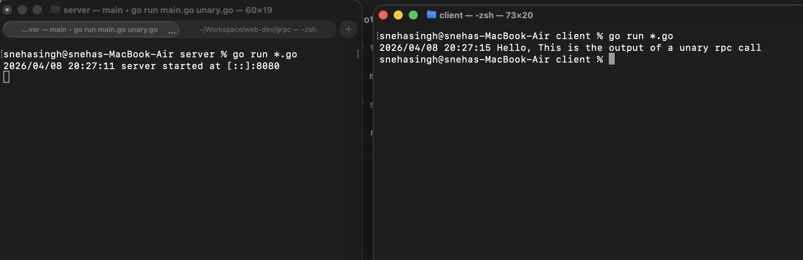
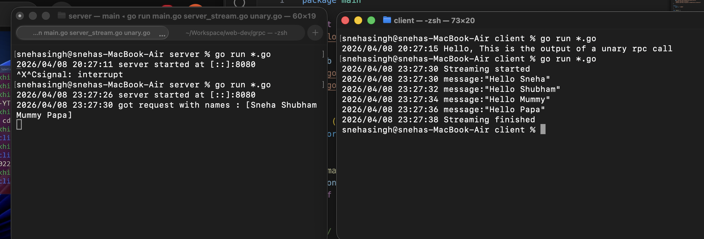
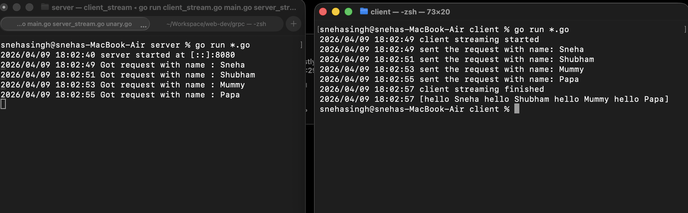
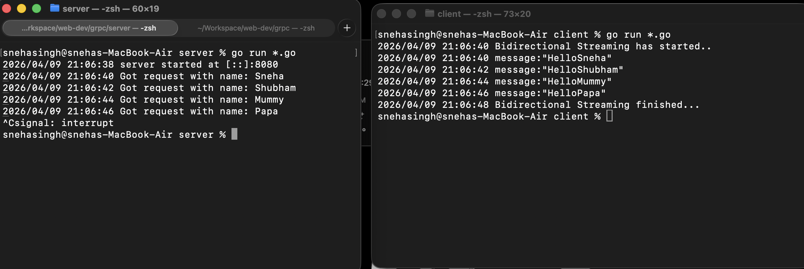

# gRPC Project - Go

A simple gRPC project with unary, server streaming, client streaming, and bidirectional streaming examples.

---

## Setup

### 1. Generate Go code from proto

```bash
protoc --go_out=. --go-grpc_out=. proto/greet.proto
```

### 2. Sync dependencies

```bash
go mod tidy
```

### 3. Run server and client

Open two terminals. From each folder, run:

```bash
go run *.go
```

---

## Output Examples

**Unary RPC:**


**Server Streaming RPC:**


**Client Streaming RPC:**


**Bidirectional Streaming RPC:**


---

## gRPC service method types

### One fixed rule

Do not invent method signatures manually. Always implement the exact method signature generated in `greet_grpc.pb.go`.

---

### 1) Unary RPC

One request -> one response.

**Server method shape**

- Input: `context.Context`, one request
- Return: one response + `error`

```go
func (s *helloServer) SayHello(ctx context.Context, req *pb.NoParam) (*pb.HelloResponse, error) {
	return &pb.HelloResponse{Message: "Hello"}, nil
}
```

---

### 2) Server Streaming RPC

One request -> many responses.

**Server method shape**

- Input: one request + stream object
- Return: only `error`
- Responses are sent using `stream.Send(...)`

```go
func (s *helloServer) SayHelloServerStreaming(req *pb.NamesList, stream pb.GreetService_SayHelloServerStreamingServer) error {
	for _, name := range req.Names {
		if err := stream.Send(&pb.HelloResponse{Message: "Hello " + name}); err != nil {
			return err
		}
	}
	return nil
}
```

---

### 3) Client Streaming RPC

Many requests -> one response.

**Server method shape**

- Input: stream object
- Return: only `error`
- Receive many with `stream.Recv()`
- Finish with one response using `stream.SendAndClose(...)`

```go
func (s *helloServer) SayHelloClientStreaming(stream pb.GreetService_SayHelloClientStreamingServer) error {
	var msgs []string
	for {
		req, err := stream.Recv()
		if err == io.EOF {
			return stream.SendAndClose(&pb.MessagesList{Message: msgs})
		}
		if err != nil {
			return err
		}
		msgs = append(msgs, "Hello "+req.Name)
	}
}
```

---

### 4) Bidirectional Streaming RPC

Many requests <-> many responses.

**Server method shape**

- Input: stream object
- Return: only `error`
- Receive with `stream.Recv()`
- Send with `stream.Send(...)`

```go
func (s *helloServer) SayHelloBidirectionalStreaming(stream pb.GreetService_SayHelloBidirectionalStreamingServer) error {
	for {
		req, err := stream.Recv()
		if err == io.EOF {
			return nil
		}
		if err != nil {
			return err
		}

		if err := stream.Send(&pb.HelloResponse{Message: "Hello " + req.Name}); err != nil {
			return err
		}
	}
}
```

**Quick note**

- `go func()` is used on the client to receive in parallel while sending.
- `waitc` is used to wait until the receive loop finishes, so the program does not exit early i.e if send completes first.
- The server does not need `go func()` or `waitc` here because it usually handles `Recv()` and `Send()` in one loop.

```go
waitc := make(chan struct{})
go func() {
	// receive loop
	close(waitc)
}()
<-waitc
```

---
